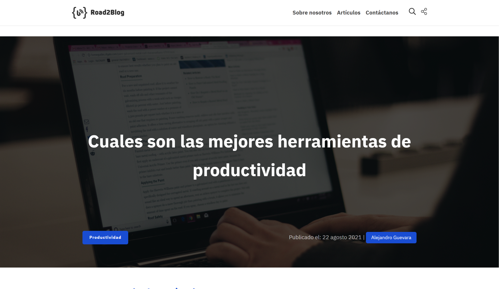

# Road2Dev | Reto N° 1

## Hola comunidad, les dejamos el reto N° 1.

Los retos de la comunidad de **Road2Dev** te ayudarán a mejorar tus habilidades, mediante la creación de proyectos.

**Necesitas tener conocimientos básicos de HTML y CSS**

## Lo que deseamos

- Ver el diseño optimo y receptivo a los diferentes tamaños de los dispositivos.
- Reutilizar código, aprender nuevas funciones, identificar secciones y estilos.

## El reto N° 1

El reto es desarrollar un blog y sus secciones y hacerlo lo mas parecido al diseño.
Puedes utilizar cualquier herramientas que te ayude a completar el reto. Si estás con una herramienta en práctica, no dudes en usarlo.

### Guía de estilos

#### Diseño

Los diseños se deberán crear con los siguientes anchos:

- Móvil: 375px
- Escritorio: 1000px.

#### Colores

Primario:

- matisse: hsl(200, 78%, 37%);
- blue: hsl(223, 79%, 46%);
- red: hsl(342, 89%, 37%);
- green: hsl(160, 74%, 34%);
- black: hsl(0, 0%, 16%);
- black-light: hsl(0, 0%, 29%);
- white: hsl(0, 0%, 100%);

#### Tipografía

- Familia https://fonts.google.com/specimen/IBM+Plex+Sans+Thai+Looped
- Pesos 300, 400 y 700

### Construye el proyecto

1. Inicialice su proyecto como un repositorio público [Github](https://github.com/), esto le ayudará a que sea más fácil compartir su código con la comunidad si necesita alguna ayuda.
2. Configure su repositorio para publicar su código en una dirección web, esto le ayudará si necesita ayuda. Hay varias formas de hacer, puede utilizar [Vercel](https://vercel.com/) o [Netlify](https://www.netlify.com/).
3. Revise los diseños para comenzar a planificar cómo abordará el proyecto. Este paso es muy crucial para ayudarlo a armar las clases de CSS y reutilizarlos.
4. Antes de agregar cualquier estilo, estructure su contenido con HTML. Le ayudará a enfocar su atención en la creación de contenido bien estructurado.
5. Crea un README.md personalizado,

### Necesitas ayuda

Envie su consulta a la comunidad de [Discord](https://discord.gg/fx6K8YSc)
Recuerde, si está buscando comentarios sobre su solución, aseguresé de crear hilos en la conversación. Cuando más específico y detallado sea con sus preguntas o consultas, tendrá mas probabilidad de que obtenga comentarios valiosos de la comunidad.

### Compartiendo tu solución

1. Envie su solución a la comunidad de [Discord](https://discord.gg/fx6K8YSc)
2. Comparta su solución:
   - Repositorio [Github](https://github.com/)
   - Sitio Web [Vercel](https://vercel.com/) o [Netlify](https://www.netlify.com/)

Esto reto es completamente gratuito. Compartelo con cualquier persona que le sea util para que pratique.

**Diviértete con este reto 😎**
